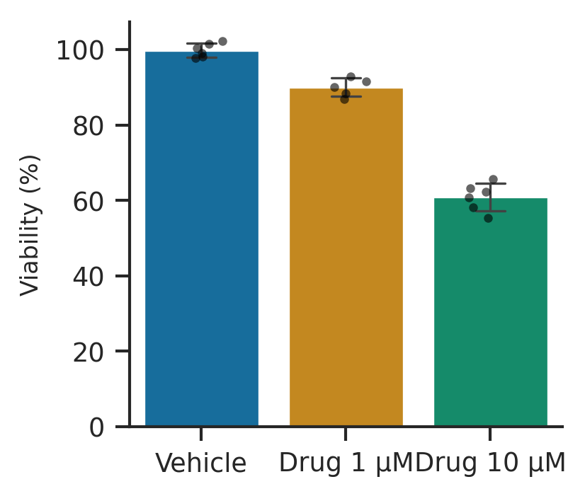
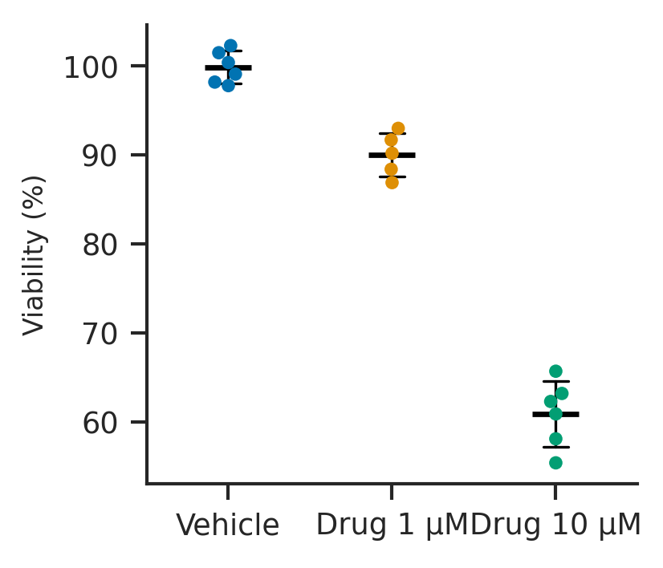

# 05. Graphs: style, model, rendering, export, recipes

Written 2026-09-24 before building milestone 0.5 (#19–#23, #43).

## What was asked

The first graphs for Column tables, bars with error bars (and optional
points) and dot plots (beeswarm with a mean or median line), with
significance brackets drawn from t test results, exported as SVG and
PNG at an exact physical size, and carrying their recipe so the exact
figure can be reopened (#43). The default look is seaborn's "ticks"
style done carefully; a Prism-like "Classic" theme is the alternative.
A graph with zero formatting has to look publishable.

## Reference

The example project's viability data drawn by seaborn 0.13.2 with
`style="ticks", context="paper", palette="colorblind"`
(`scripts/seaborn-reference.py`):

| Bars, SD, points | Swarm with mean and SD |
|---|---|
|  |  |

What we take: despined axes (no top or right spine), short outward
ticks, the colour-blind palette, generous whitespace, a plain sans. What
we do better: seaborn's x labels collide ("Drug 1 µMDrug 10 µM"), its
bars are solid and heavy, its points are black blots over them.

## Style: the "Modern" theme

- **Font:** Arimo (SIL OFL 1.1; `design/fonts/`), metrically identical
  to Arial. Exports name `Arial, Arimo, "Liberation Sans", Helvetica,
  sans-serif`, so an SVG opened where Arial is installed lays out the
  same, and Arimo is embedded wherever we rasterise. No webfont request:
  the WOFF files are served with the app (`public/fonts/`, 21 KB each,
  subset by `scripts/make-graph-font.py`).
- **Sizes at final size** (points): tick labels 7, axis titles 8, graph
  title 8 bold, bracket labels 7. Journals ask for 6–7 pt minimum after
  reduction; the defaults already meet it at 100%.
- **Lines** (points): axes 0.75, ticks 0.75 × 3 long, outward; error
  bars 0.75 with caps ½ the bar width; bar edges 0.75; brackets 0.75.
  0.75 pt survives reduction to 50%; seaborn's paper context is thinner.
- **Colour:** seaborn `colorblind` (`src/graphs/palette.ts`), one colour
  per data set, from the table (note 02, decision 4). **Bars** are the
  colour mixed 55% with white, with an edge of the colour itself, so
  error bars and points on top stay readable. **Points** are the colour
  at 80% opacity with a 0.4 pt edge of the colour darkened 30%, so
  overplotted points still read as separate. Error bars and mean lines
  are ink (`#201e1d`), not the group colour.
- **Layout:** despined, no grid, no frame, no background. Group labels
  under the axis, wrapped onto two lines when they don't fit their slot
  (never overlapping, never rotated by default). The value axis starts
  at 0 for bars (a bar is a length); for dot plots it fits the data.
- **"Classic"** (Prism-like): all four spines (boxed), inward ticks,
  solid bars with black edges, black points. Same font and sizes.

Themes are data: a `GraphTheme` object (fonts, sizes, line widths,
colours, spines, tick direction, fills) with per-graph overrides on top.
A graph stores the theme's *name* plus its overrides, so a project
follows improvements to "Modern"; a figure recipe (below) stores the
*resolved* theme, so an exported figure never changes.

## Graph model (#20)

```ts
interface Graph {
  id; title;
  source: { kind: 'table'; table: Id };   // a Column table, for now
  dataSets: readonly Id[] | null;          // null: all, in table order
  analyses: readonly Id[];                 // t tests whose brackets it draws
  plot: ColumnPlot;
  size: { width: number; height: number }; // millimetres, the final size
  theme: { kind: 'named'; name: 'modern' | 'classic' } | { kind: 'fixed'; theme: GraphTheme };
  format: GraphFormat;                     // overrides: axis titles, range, per-bracket settings, …
}

type ColumnPlot =
  | { kind: 'bars'; error: ErrorBar; points: boolean }
  | { kind: 'dots'; center: 'mean' | 'median'; error: ErrorBar };

type ErrorBar = 'sd' | 'sem' | 'ci95' | 'range' | 'none';
```

- **Error bars need statistics**, and statistics come from R (CLAUDE.md,
  Stack). A graph therefore has an implicit descriptive-statistics run
  of its data sets: the results bridge adds, for each graph, a virtual
  analysis (`<graph id>/summary`) to what `Recompute` sees, so the
  summary is computed, cached by input hash, saved with the project and
  reused like any result. Points and the beeswarm read the table
  directly.
- A graph is created from a table sheet ("New graph" → bars or dots),
  appears under Graphs in the navigator, and is linked both ways, like
  analyses. Adding a t test of the same table offers its brackets.

## Rendering (#20)

`layout(graph, table, summary, results, theme) → Scene` is **pure**:
every mark as a positioned primitive (rect, line, circle, path, text)
in points, with the final size fixed. The React view renders the scene
as SVG at the screen's zoom; export serialises the same scene. So what
is on screen is what is exported, and tests assert on the scene.

- **Text is measured, not guessed:** `src/graphs/text/metrics.json`
  holds Arimo's advance widths per code point (both weights), so layout
  measures labels without a DOM and lays out identically in every
  browser, in tests and on reopen. SVG text is drawn with kerning off,
  matching the measurement.
- **D3 only for maths** (CLAUDE.md): `d3-scale` for linear scales and
  nice ticks; no D3 DOM.
- **Axis range:** auto from the data (bars from 0; dots padded 5%),
  nice ticks (d3), tick labels to the precision the step needs.

## Plots (#21)

- **Bars:** mean as the bar, the error bar above it (and below, in
  Classic), points optional on top.
- **Dots:** every value as a point in a **beeswarm**: points are placed
  in order of value at the horizontal offset closest to the centre that
  doesn't overlap a point already placed (seaborn's swarm algorithm),
  so the layout is deterministic; a slot too narrow for the swarm
  squeezes it rather than overlapping, and says so in the notes. A mean
  (or median) line with the error bar.
- **Excluded values** are not plotted (as Prism); empty cells never are.
- **Notes under the graph** state the error bar ("Mean ± SD", "Median
  with interquartile range" is later) and the asterisk scheme when
  brackets are shown. They are part of the figure's recipe, not the
  image (see Export), so the user decides whether to include them.

## Significance brackets (#22)

- Drawn from **t test results** in `graph.analyses` (post-hoc tests
  later): one bracket per comparison, between the two groups' slots.
- **Labels:** asterisks by the scheme (Prism's default), or exact P
  (`P = 0.0021`, `P < 0.0001`), per graph; `ns` shown or hidden.
- **Stacking:** brackets are placed lowest first, shortest span first;
  each sits a fixed gap above the highest mark (bar, error bar or point)
  under its span and above any bracket it overlaps horizontally. No two
  overlap; the plot's top margin grows to fit them.
- **Live:** a bracket shows only when its t test's result is current;
  while a test reruns, its bracket is hidden rather than showing an old
  P. A bracket whose test can't run (e.g. its group was deleted) is
  dropped with a note.
- Per-bracket settings (hide, label style) now; dragging to adjust
  height comes with the formatting inspector (1.0).

## Export (#23)

- **Sizes:** the graph's own size, with presets by journal column width
  (Nature: single 89 mm, 1.5 column 120 mm, double 183 mm; height
  kept in proportion or set), changed as a graph edit (undoable).
  Changing the size relays out: fonts and lines keep their point sizes,
  as a journal requires.
- **SVG:** `width`/`height` in mm, `viewBox` in points; text as text
  (editable in Illustrator and Inkscape) with the font stack above;
  colours as hex; no filters, masks or CSS the editors mishandle.
  Outlined text is a later option.
- **PNG:** the same SVG, with Arimo embedded as a data URI, drawn to a
  canvas at 300 or 600 DPI (pixels = mm / 25.4 × DPI), written with a
  `pHYs` chunk so the DPI is recorded.

## Reproducible figures (#43)

- **Recipe:** a `.bsig` document cut down to the graph, its table and
  its analyses with their current results, and the graph's theme
  **resolved** (`theme: { kind: 'fixed', … }`), plus app and engine
  versions. When "Include the data so this figure can be reopened" is
  on (the default), it is embedded; off, only the origin note is.
- **Where it goes:** SVG — a leading comment, `<desc>`, and a
  `<metadata>` element holding RDF/Dublin Core (title, creator tool) and
  the recipe in a `barelysig:recipe` element (base64 of the gzipped
  JSON). PNG — `tEXt` Software, Title, Description (the origin
  sentence), `iTXt` `XML:com.adobe.xmp` (CreatorTool), and a compressed
  `iTXt` `barelysig-recipe`.
- **Origin sentence:** "Made with BarelySig 0.5.0. Open this file in
  BarelySig (<app URL>) to edit the figure." — or, without data, "…
  The data were not included, so it can't be reopened."
- **Opening a figure:** an exported SVG or PNG can be opened or dropped
  like a `.bsig`; its recipe becomes a new project with the graph open.
- **Export history:** each export stores its recipe in the project's
  `exports` (name, date, size, format); "Restore this figure" opens that
  recipe the same way, for when the project changed since.
- **Tests:** a recipe read back renders the byte-identical SVG, and a
  PNG's chunks survive a round trip. Checking the origin note in
  Inkscape, exiftool and macOS Get Info is a manual step on the issue.

## Decisions made here

1. **Arimo, named after Arial in exports**, text as text.
2. **Bars soft with a coloured edge, points coloured with an edge;**
   error bars in ink.
3. **Error-bar statistics from R**, through a graph's virtual summary.
4. **Bars start at zero**; dot plots fit the data.
5. **Wrapped, never overlapping, group labels.**
6. **Brackets hide while their test is outdated.**
7. **Nature's column widths** as the size presets.
